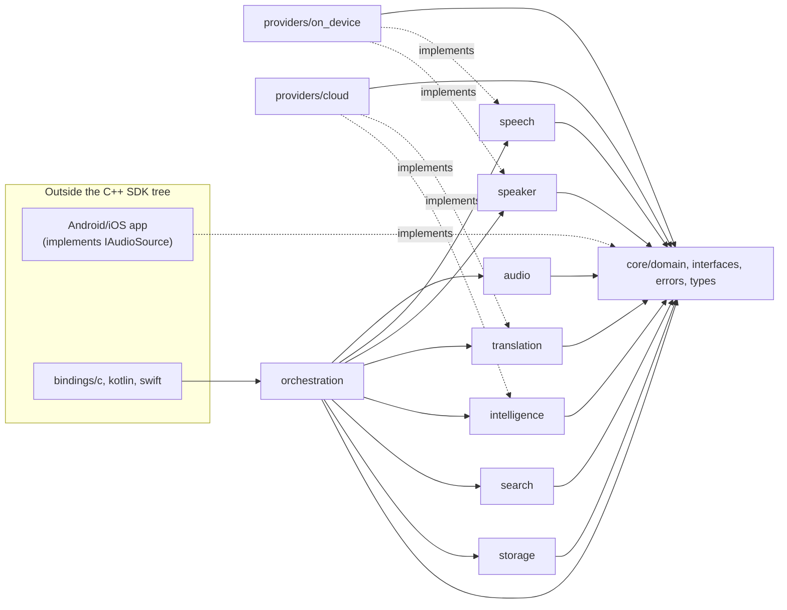

# Requirements, System Architecture & Module Structure

Milestone 0. Architecture and rationale only — no implementation code.

## 1. Requirements

### 1.1 Functional (synthesized from the 20 product-goal items)

- **Capture & signal conditioning** — start/stop a meeting, capture mic audio, reduce noise,
  detect speech vs. silence (VAD), segment continuous audio into utterances.
- **Speech understanding** — transcribe (streaming, on-device-first), detect language per segment,
  represent intra-segment code-switching (Hindi-English and others), diarize speakers, assign
  transcript spans to speakers.
- **Meeting intelligence** — summary, action items (owner/deadline/source/confidence), decisions,
  topics, questions/unresolved items, each traceable back to a source transcript timestamp.
- **Cross-language access** — translate transcript/summary to a user-selected language on demand;
  multilingual embeddings; cross-language semantic search (a query in one language retrieves
  content spoken in another).
- **Persistence & retrieval** — encrypted local storage of meetings, transcripts, speakers,
  embeddings, intelligence outputs; semantic search with metadata/speaker/date filtering.
- **Extensibility** — every AI capability (STT, diarization, translation, embeddings, LLM
  extraction) must be replaceable behind an interface, including an optional cloud tier.

### 1.2 Non-functional

- **Privacy-first, on-device-first**: no network egress from any AI capability unless that
  specific capability's provider slot is explicitly set to `Cloud` by the host app/user.
- **Offline-first**: recording, VAD, on-device STT/diarization/language-detection/summarization,
  local embeddings, and local search all function with zero connectivity.
- **Platform-independent core**: the C++ SDK builds and is fully testable with no Android/iOS
  toolchain present.
- **Testability**: every domain component is unit-testable against a fake, without real model
  inference (see `04-testing-and-performance-strategy.md`).
- **Replaceability without core rewrite**: STT/LLM/translation/embedding/diarization/storage
  engines and cloud providers must be swappable via configuration, not code changes to
  `orchestration` or `core`.

## 2. System architecture

```text
Android App / iOS App
        |
   KMP common API  (commonMain: platform-neutral models, one facade)
        |
   Stable C API boundary   <-- see decision below
        |
   C++ Core SDK (domain + orchestration + feature modules)
        |
   Providers (on-device | cloud | custom)
```

**Decision: KMP crosses into native code through one stable C API, not JNI on Android plus
Objective-C++ on iOS as two independent hand-maintained bridges.**

The prompt's suggested shape has KMP talk to Android through JNI and to iOS through Objective-C++
directly. Evaluated against the actual cost over years of maintenance, this is worse than a single
C API:

- **Two bridges duplicate every marshaling decision.** Every domain type (`Meeting`,
  `TranscriptSegment`, error codes, callback threading) has to be marshaled twice, by two
  different mechanisms, and any drift between them (e.g. `ActionItem.deadline` optionality handled
  differently) is a runtime bug that surfaces per-platform instead of at one compile boundary.
- **A C API is what both JNI and Objective-C++ actually need anyway** — JNI is comfortable calling
  `extern "C"` functions with primitive/opaque-handle signatures, and Objective-C++ calls into it
  just as directly as it would call C++ classes, without the ABI fragility of exposing C++ classes
  (name mangling, exceptions, STL container layout) across a shared-library boundary.
- **One reviewable surface.** A single `bindings/c/meeting_sdk.h` is the entire contract the core
  SDK promises to platforms. `bindings/kotlin` (JNI) and `bindings/swift` (Objective-C++) both
  become thin, mechanical marshaling layers over that one header, each independently thin rather
  than each independently reinventing the marshaling contract.

Cost of this choice: an extra layer (hand-written C API) that a direct-JNI approach would skip.
Accepted, because that layer is small, mechanical, and is exactly what makes `orchestration`'s
public surface reviewable and stable across two platform bridges instead of duplicated in each.

Everything above `orchestration` (KMP, platform apps) is explicitly kept ignorant of C++
ownership semantics, exceptions, and STL types — the C API and the `bindings/*` layers own 100% of
that translation, per §25 of the product spec (no raw pointers, no native types leaking into
Kotlin/Swift).

## 3. Module structure & dependency rule

**Dependency rule**: every module may depend only on `core/*`. Feature modules
(`audio`, `speech`, `speaker`, `translation`, `intelligence`, `search`, `storage`) never depend on
each other — `orchestration` is the only module permitted to see across features, because it is
the one place the pipeline shape (§7 of the product spec) is allowed to exist.
`providers/on_device` and `providers/cloud` depend on `core` and *implement* feature-module
interfaces; they are never depended upon by the interfaces they implement (classic Dependency
Inversion — feature modules own their interfaces, providers plug into them).

**Deviation from the prompt's suggested tree**: `platform/android`, `platform/ios`, and
`bindings/*` are **not** part of the C++ SDK's own module tree. Putting platform code inside the
C++ SDK — even as leaf modules — would make "the core SDK must build independently of
Android/iOS" (§28 of the product spec) an aspiration enforced by convention rather than by the
build graph. Instead:

- The platform app (Android/iOS) implements `core/interfaces::IAudioSource` and injects it into
  `orchestration` at startup — audio capture is a caller-supplied dependency, not an SDK-internal
  module.
- `bindings/kotlin` and `bindings/swift` live in their own top-level tree next to, not inside, the
  C++ SDK; they depend on `orchestration`'s facade through the C API (§2) and depend on nothing
  else in the SDK.

```text
meeting-sdk/                       (builds standalone: no Android/iOS toolchain required)
├── core/
│   ├── domain/          # Meeting, TranscriptSegment, Speaker, ActionItem, ... (value types)
│   ├── interfaces/       # IAudioSource, ISpeechToTextEngine, IVAD, IMeetingRepository, ...
│   ├── errors/            # Error, ErrorCategory, Result<T>
│   └── types/               # strong IDs, Timestamp, Duration_, Language
├── audio/          { capture, buffering, preprocessing, vad }      -> core only
├── speech/           { stt, language_detection, segmentation }       -> core only
├── speaker/            { diarization, embeddings, speaker_assignment } -> core only
├── translation/                                                        -> core only
├── intelligence/    { summarization, action_items, decisions, topics, questions } -> core only
├── search/               { embeddings, indexing, retrieval }         -> core only
├── storage/                { database, encryption, repository }        -> core only
├── providers/
│   ├── on_device/     # implements speech/speaker/search interfaces with local models
│   └── cloud/            # implements translation/intelligence/* interfaces; opt-in only
└── orchestration/
    └── meeting_pipeline/   # the only module allowed to depend across audio/speech/speaker/
                             # translation/intelligence/search/storage; owns the pipeline (§7)

bindings/            (outside the SDK tree; depends on orchestration's C API facade only)
├── c/                 # the stable C API boundary (§2)
├── kotlin/           # JNI, thin marshaling only
└── swift/              # Objective-C++, thin marshaling only
```



(Full pipeline, platform-integration, and trust-boundary diagrams: `05-diagrams.md`.)

## 4. Design pattern decisions

Patterns are included only where they resolve a real problem stated above; each entry states the
alternative considered and the complexity accepted.

- **Strategy — every AI capability (`ISpeechToTextEngine`, `ISpeakerDiarizer`, `ITranslator`,
  `IEmbeddingEngine`, `ILLMEngine`)**: `orchestration` codes against the interface once; on-device
  vs. cloud vs. custom is a runtime-selected implementation. *Alternative considered*: a single
  "AI backend" god-interface with a mode flag — rejected because it would force every capability to
  share one on/off switch, defeating the per-capability cloud-consent requirement (§13, §15 of the
  product spec). *Cost*: one interface + N implementations per capability instead of one branchy
  class; accepted, it's the mechanism that keeps replaceability real.
- **Abstract Factory — `AIProviderFactory`**: given one `AIProviderConfig`, constructs a coherent
  bundle of providers (one per capability) so `orchestration` never hand-wires which concrete
  provider satisfies which interface. *Alternative considered*: constructor-inject each provider
  individually from the platform app — rejected as the default because it pushes provider-selection
  logic (and the invariant in `03-threat-model-and-security.md` §6 that enabling one cloud slot
  must not leak into another) out of the SDK into every host app. *Cost*: one more class; accepted.
- **Repository — `IMeetingRepository`**: isolates `core`/`orchestration` from any concrete
  storage engine (SQLite/Room/Core Data). *Alternative considered*: direct storage-engine calls from
  `storage/*` — rejected, it would leak persistence technology into the domain layer, violating
  §16 of the product spec. *Cost*: minimal; this is a thin, well-understood pattern.
- **State — `MeetingState` (Idle → Recording → Paused → Processing → Completed → Failed)**:
  transitions are validated centrally in `orchestration`, not scattered across call sites that set
  the enum directly. *Alternative considered*: an implicit state machine derived from which
  pipeline stage is active — rejected, it makes "is recording currently pausable" a
  distributed question instead of a table lookup. *Cost*: a small transition table; accepted.
- **Pipeline / Chain-of-Responsibility-flavored orchestration — `orchestration/meeting_pipeline`**:
  the audio→...→search flow (§7 of the product spec, diagrammed in `05-diagrams.md` §3) is modeled
  as an ordered sequence of independently swappable stages, each depending only on `core`
  interfaces. *Alternative considered*: a monolithic `processAudio()` orchestrator method —
  rejected, it would make "replace STT independently of diarization" (§4 of the product spec)
  impossible without touching orchestration code. *Cost*: more types (one per stage boundary);
  accepted as the direct implementation of the product's own pipeline requirement.
- **Facade — the C API boundary (§2)**: one narrow, versioned entry point hides `orchestration`'s
  internal composition from every platform binding. *Alternative considered*: expose
  `orchestration` classes directly across the C API — rejected, it would couple the C API's shape
  to internal refactors. *Cost*: one translation layer; accepted, see §2 for the full rationale.
- **Dependency Injection, everywhere**: every component takes its collaborators as
  constructor-injected `core/interfaces` references (no service locator, no global registry, no
  singletons). This is what makes the fake-based unit-testing strategy in
  `04-testing-and-performance-strategy.md` possible at all.
- **Explicitly rejected**: Observer/event-bus for pipeline stage transitions (the pipeline is a
  bounded, known sequence — an event bus would trade compile-time traceability for indirection
  with no corresponding flexibility win); Visitor over domain models (no open-ended operation set
  over `Meeting`/`TranscriptSegment` exists yet — would be speculative); Singleton anywhere (product
  spec §3 explicitly disfavors it, and DI already solves the "one instance" cases that matter, e.g.
  a single `IClock` per process, without the global-state cost).

## 5. See also

- `02-interfaces-and-data-models.md` — the concrete interfaces and value types this module
  structure hosts.
- `03-threat-model-and-security.md` — how the provider/cloud module boundary enforces consent
  structurally, not by convention.
- `04-testing-and-performance-strategy.md` — how the DI decision above is exercised in tests.
- `05-diagrams.md` — full diagram set (system, pipeline, platform integrations, data model,
  trust boundaries).
