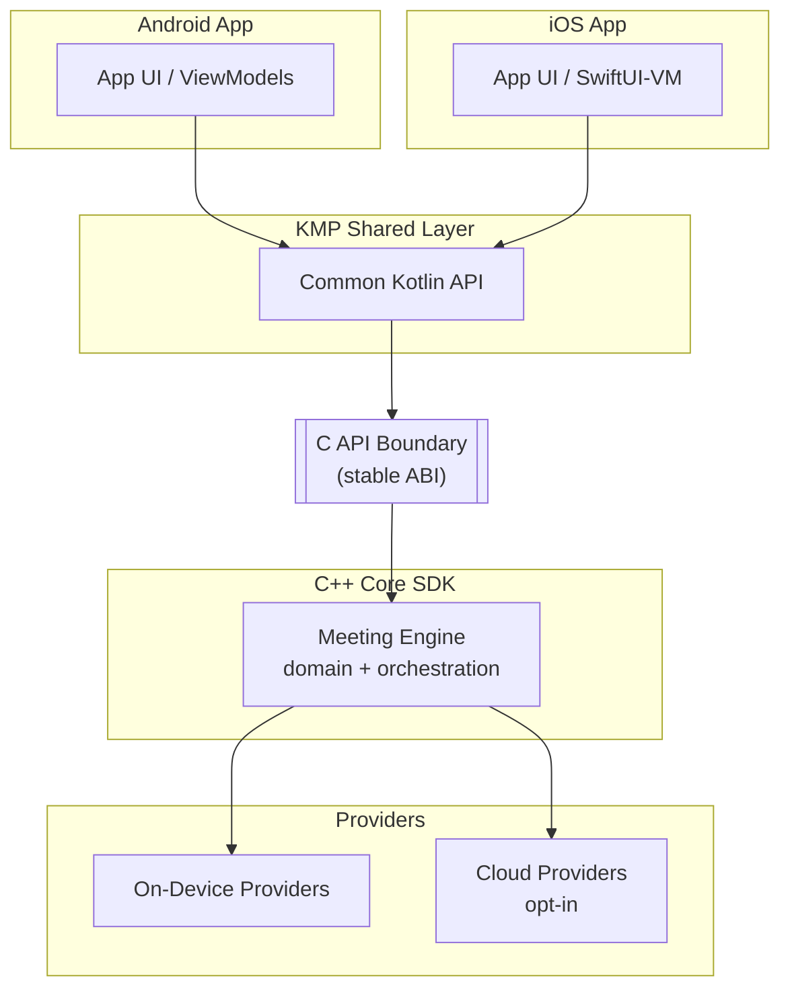
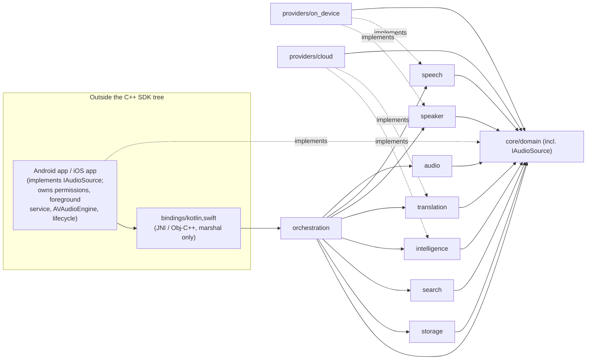
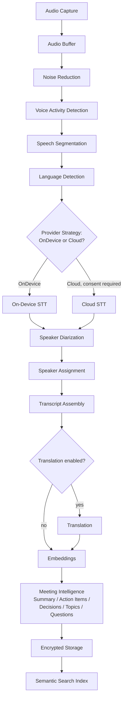
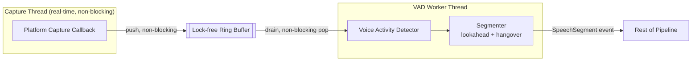
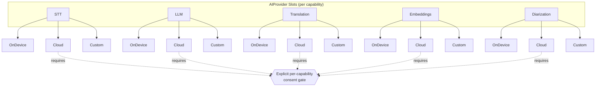
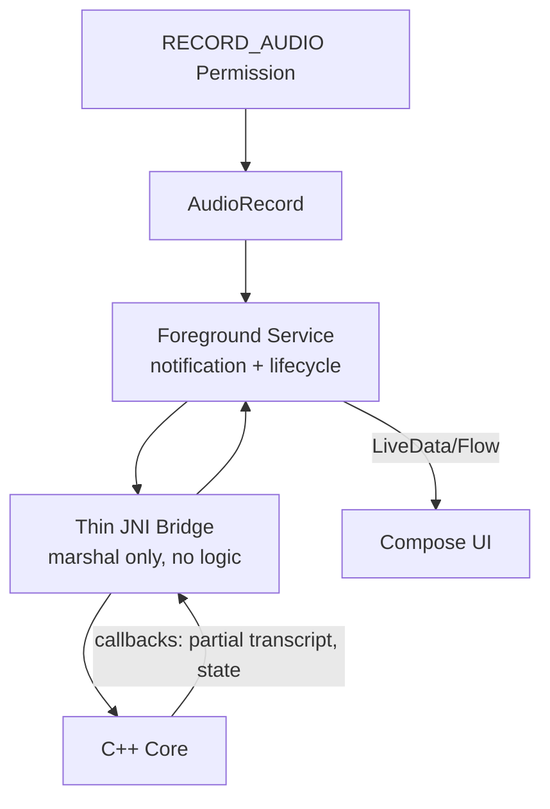
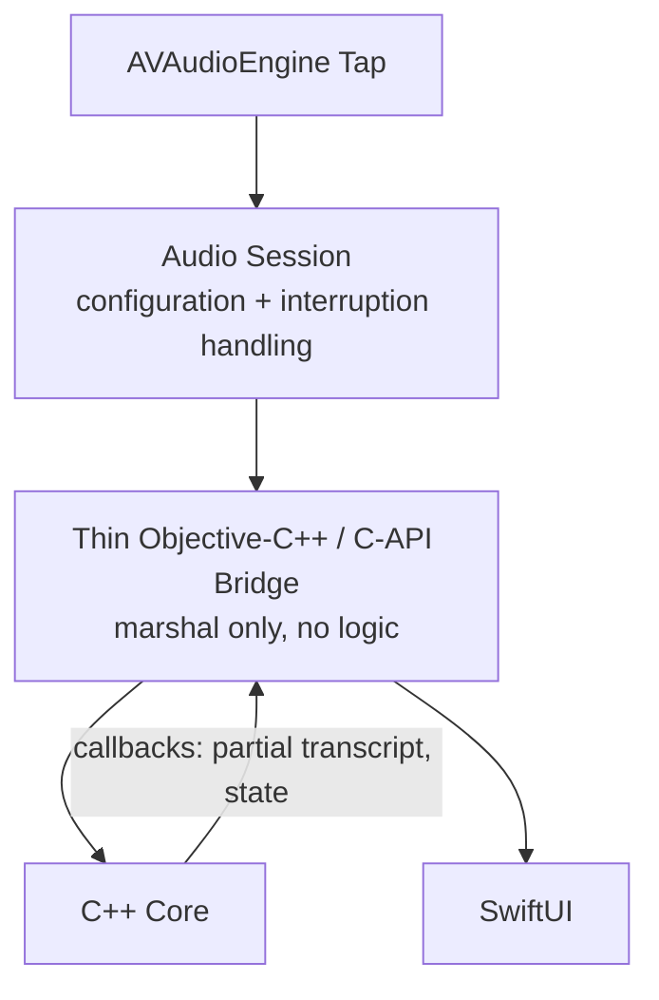
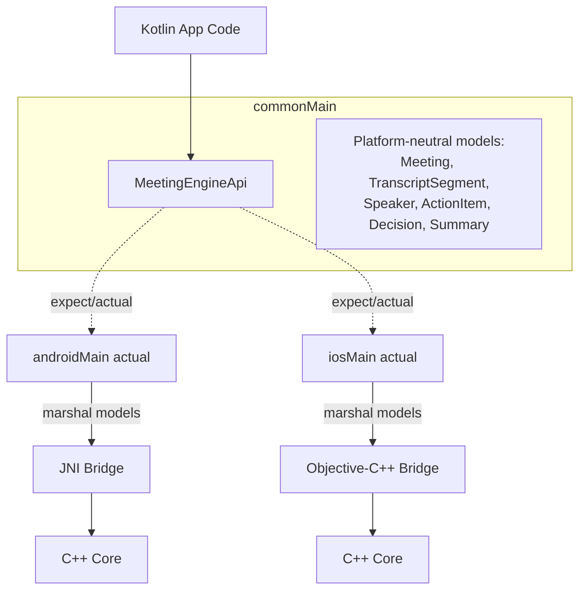
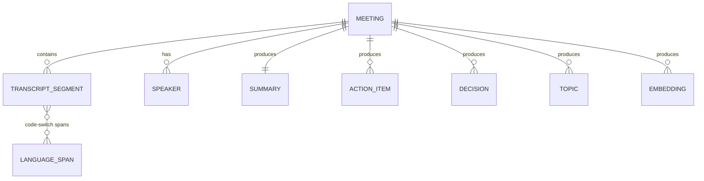
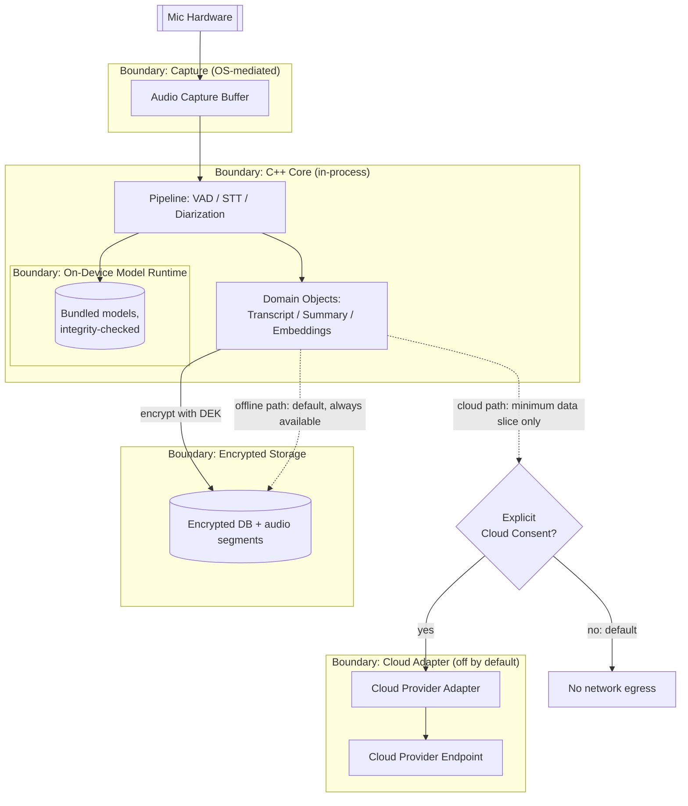

# Architecture Diagrams

Ten diagrams covering the Meeting Mode SDK's structure, pipeline, platform integrations, data
model, and security boundaries. This is a companion reference for Milestone 0 — each diagram is
architecture-only (no implementation code), with brief prose for orientation only.

## 1. System architecture

The SDK is layered: platform apps talk to a Kotlin Multiplatform shared layer, which crosses into
native code through a stable C API, into the C++ core, which in turn drives pluggable providers.

## 2. C++ module dependency graph

Modules form a DAG: every module depends on `core/domain`, feature modules never depend on each
other, and `orchestration` is the only module allowed to see across features. `platform/android`
and `platform/ios` are deliberately **not** part of this tree — per `01-requirements-and-architecture.md` §3,
keeping them inside the C++ SDK would violate the requirement that the core build independently of
Android/iOS. Instead, the platform apps implement `core/interfaces::IAudioSource` and inject it in;
`bindings/kotlin,swift` marshal across the JNI/Obj-C++ boundary and depend on `orchestration`'s
facade, but nothing in this graph depends on them.

## 3. Meeting processing pipeline

The full pipeline from raw audio to searchable transcript. At each pluggable stage — STT here as
the representative example — the Strategy-pattern `AIProvider` decides on-device vs. cloud at
runtime; the same branch shape repeats for diarization, translation, embeddings, and intelligence.

## 4. Audio pipeline (thread boundaries)

The capture thread only ever writes into a lock-free ring buffer and never blocks; a separate
worker thread drains it for VAD and segmentation, keeping real-time audio capture isolated from
variable-latency processing.

## 5. AI provider architecture

Every pluggable capability is a `AIProvider` interface with independently swappable
implementations. Cloud implementations are never constructed by default; they activate only after
an explicit per-capability consent grant.

## 6. Android integration

`AudioRecord` runs inside a foreground service so capture survives backgrounding; a thin JNI
bridge marshals data only, with no business logic, into the C++ core.

## 7. iOS integration

`AVAudioEngine` taps the input node under a configured audio session; a thin Objective-C++/C-API
bridge marshals buffers and callbacks into the C++ core without embedding logic.

## 8. KMP architecture

Kotlin app code calls a platform-neutral common API; `expect`/`actual` resolves to the native
bridge per platform, where domain models are marshalled across the JNI or Objective-C++ boundary.

## 9. Data model (ER)

Core entities and their cardinalities: a meeting owns its transcript, speakers, and derived
intelligence; transcript segments carry many-to-many language spans for code-switched speech.

## 10. Security / data-flow boundaries

Trust boundaries from microphone hardware down to storage, with cloud as a separate, off-by-default
boundary. The offline path never leaves boundary 3; the cloud path exists only past an explicit
consent gate and carries the minimum data slice for the one consented capability.

